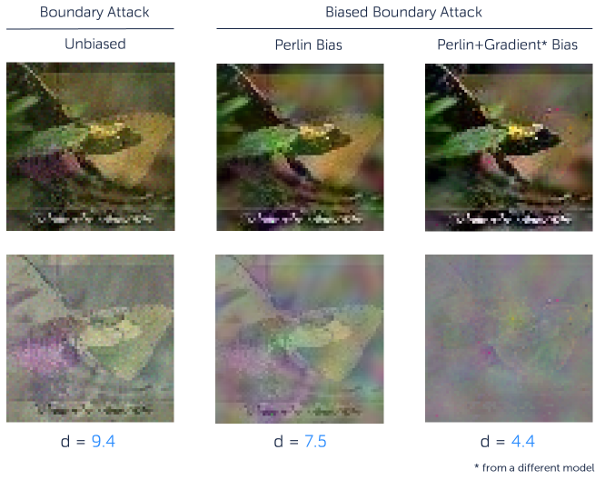

## Biased Boundary Attack: NeurIPS 2018 Adversarial Vision Challenge

This repository contains an implementation of the Biased Boundary Attack on Tiny ImageNet, as described in the paper **Guessing Smart: Biased Sampling for Efficient Black-box Adversarial Attacks** (https://arxiv.org/abs/1812.09803).
 

This code is our final submission to the **NeurIPS 2018 Adversarial Vision Challenge**. 
We achieved second place with this submission to the **Targeted Attack** track. See [the leaderboard](https://www.crowdai.org/challenges/nips-2018-adversarial-vision-challenge-targeted-attack-track/leaderboards) and [the final results](https://medium.com/bethgelab/results-of-the-nips-adversarial-vision-challenge-2018-e1e21b690149).

All of our submissions are also available on crowdAI:
- [Robust Model](https://gitlab.crowdai.org/ttbrunner/nips18-model/) (scored 6th place)
- [Untargeted Attack](https://gitlab.crowdai.org/ttbrunner/nips18-untargeted-attack/) (scored 5th place)
- [Targeted Attack](https://gitlab.crowdai.org/ttbrunner/nips18-targetted-attack/) (this, scored 2nd place)

Highlights:
- attacks/methods/biased_boundary_attack.py: Implementation of the BBA attack.

- attacks/multi_boundary_attack.py: Chooses adequate starting points for the BBA attack. 

#### Team Members

- Thomas Brunner
- Frederik Diehl
- Michael Truong Le

(fortiss, Technical University Munich)
